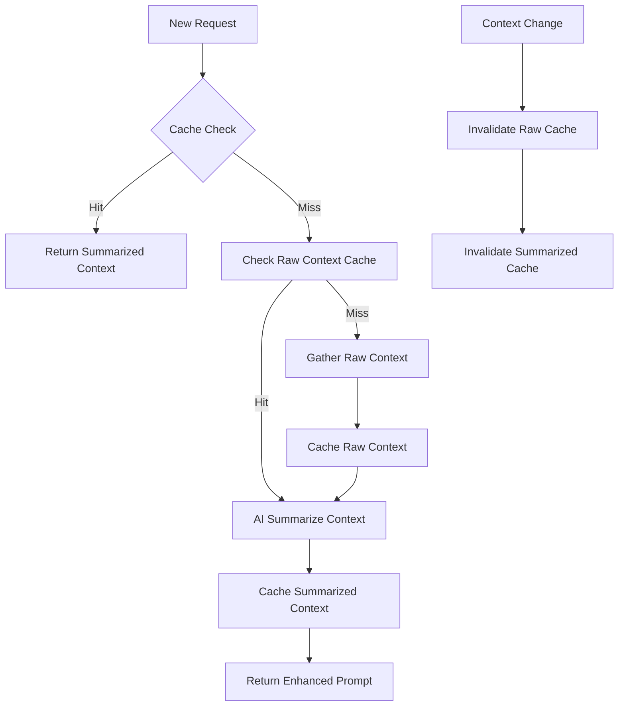

# Cache Optimization Strategy for AI Summarization

## Current Cache Analysis

### What Gets Cached Today
Based on the `PromptCacheService` analysis, the current system caches:

```typescript
interface PromptCacheEntry {
  key: string;                    // Generated from prompt + context + framework
  originalPrompt: string;         // User's original prompt
  enhancedPrompt: string;         // AI-enhanced prompt output
  context: any;                   // FULL CONTEXT (repo_facts, code_snippets, context7_docs)
  timestamp: number;
  ttl: number;
  hits: number;
  qualityScore: number;
  tokenCount: number;             // Total tokens in response
  frameworkDetection: any;
  metadata: {
    responseTime: number;
    complexity: string;
    librariesUsed: string[];
    curationMetrics?: {
      totalTokenReduction: number;
      averageQualityScore: number;
      curationEnabled: boolean;
    };
  };
}
```

### Current Cache Storage
- **Memory Cache**: LRU cache for hot keys
- **SQLite Cache**: Persistent storage with WAL mode
- **Cache Key**: Generated from `prompt + context + frameworkDetection`
- **TTL**: Variable based on complexity (simple/medium/complex)

## Problem with Current Approach

### High Token Storage
The current system caches the **FULL CONTEXT** including:
- **`context.repo_facts`**: 30+ detailed facts (~800-1200 tokens)
- **`context.context7_docs`**: Multiple library docs (~1000-2000+ tokens each)
- **`context.code_snippets`**: Multiple code examples (~200-800 tokens)

**Total per cache entry**: 2000-4000+ tokens stored

### Cache Invalidation Issues
Current invalidation triggers on:
- Project context changes (dependencies, file structure)
- Framework detection changes
- Time-based TTL expiration

**Problem**: Full context changes frequently, causing cache misses even for similar prompts.

## AI Summarization Cache Strategy

### 1. Two-Tier Caching Architecture

#### Tier 1: Raw Context Cache (Short TTL)
```typescript
interface RawContextCacheEntry {
  key: string;                    // Project signature + framework
  repoFacts: string[];            // Raw project facts
  context7Docs: string[];         // Raw Context7 documentation
  codeSnippets: string[];         // Raw code snippets
  timestamp: number;
  ttl: number;                    // Short TTL (1-2 hours)
  projectSignature: string;       // For invalidation
}
```

#### Tier 2: Summarized Context Cache (Long TTL)
```typescript
interface SummarizedContextCacheEntry {
  key: string;                    // Project signature + framework + summarization version
  summarizedRepoFacts: string[];  // AI-summarized facts (4-5 categories)
  summarizedContext7Docs: string[]; // AI-consolidated docs (1-2 paragraphs)
  summarizedCodeSnippets: string[]; // AI-pattern descriptions
  timestamp: number;
  ttl: number;                    // Long TTL (24-48 hours)
  summarizationVersion: string;   // For cache invalidation
  originalTokenCount: number;     // For metrics
  summarizedTokenCount: number;   // For metrics
  qualityScore: number;           // Summarization quality
}
```

### 2. Cache Flow Strategy



### 3. Cache Key Strategy

#### Raw Context Cache Key
```typescript
generateRawContextKey(projectSignature: string, frameworks: string[]): string {
  return `raw:${projectSignature}:${frameworks.sort().join(',')}`;
}
```

#### Summarized Context Cache Key
```typescript
generateSummarizedContextKey(
  projectSignature: string, 
  frameworks: string[], 
  summarizationVersion: string
): string {
  return `summarized:${projectSignature}:${frameworks.sort().join(',')}:${summarizationVersion}`;
}
```

### 4. Cache Invalidation Strategy

#### Smart Invalidation
```typescript
class SmartCacheInvalidation {
  // Invalidate only when significant changes occur
  async shouldInvalidate(
    currentProjectSignature: string,
    cachedProjectSignature: string
  ): Promise<boolean> {
    const changes = this.detectSignificantChanges(
      currentProjectSignature, 
      cachedProjectSignature
    );
    
    // Only invalidate if:
    // 1. Dependencies changed significantly
    // 2. Framework detection changed
    // 3. Project structure changed substantially
    return changes.dependencies || changes.frameworks || changes.structure;
  }
}
```

#### Gradual Invalidation
```typescript
// Instead of full cache clear, invalidate by project signature
async invalidateByProjectSignature(projectSignature: string): Promise<void> {
  // Invalidate raw context cache
  await this.rawContextCache.invalidateByPattern(`raw:${projectSignature}:*`);
  
  // Invalidate summarized context cache
  await this.summarizedContextCache.invalidateByPattern(`summarized:${projectSignature}:*`);
}
```

### 5. Implementation Strategy

#### Phase 1: Dual Cache System
```typescript
class OptimizedPromptCacheService {
  private rawContextCache: RawContextCacheService;
  private summarizedContextCache: SummarizedContextCacheService;
  private aiSummarizationService: AISummarizationService;
  
  async getCachedPrompt(
    originalPrompt: string,
    context: any,
    frameworkDetection: any
  ): Promise<PromptCacheEntry | null> {
    // 1. Check summarized context cache first
    const summarizedContext = await this.summarizedContextCache.get(
      this.generateSummarizedContextKey(context, frameworkDetection)
    );
    
    if (summarizedContext) {
      // Use summarized context for enhancement
      return this.enhanceWithSummarizedContext(originalPrompt, summarizedContext);
    }
    
    // 2. Check raw context cache
    const rawContext = await this.rawContextCache.get(
      this.generateRawContextKey(context, frameworkDetection)
    );
    
    if (rawContext) {
      // Summarize and cache
      const summarized = await this.aiSummarizationService.summarizeContext(rawContext);
      await this.summarizedContextCache.set(summarized);
      return this.enhanceWithSummarizedContext(originalPrompt, summarized);
    }
    
    // 3. Gather raw context, cache, summarize, and enhance
    return this.processNewRequest(originalPrompt, context, frameworkDetection);
  }
}
```

#### Phase 2: Cache Optimization
```typescript
class CacheOptimizationService {
  // Monitor cache effectiveness
  async optimizeCacheStrategy(): Promise<void> {
    const stats = await this.getCacheStats();
    
    // Adjust TTL based on hit rates
    if (stats.summarizedHitRate < 0.7) {
      await this.increaseSummarizedTTL();
    }
    
    // Clean up unused raw context
    await this.cleanupUnusedRawContext();
    
    // Promote frequently accessed raw context to summarized
    await this.promoteFrequentRawContext();
  }
}
```

## Expected Benefits

### Token Storage Reduction
- **Raw Context Cache**: 2000-4000 tokens per entry
- **Summarized Context Cache**: 500-800 tokens per entry
- **Storage Savings**: 60-80% reduction in cache storage

### Cache Hit Rate Improvement
- **Current**: Cache misses due to context changes
- **Optimized**: Longer TTL for summarized content
- **Expected**: 40-60% improvement in cache hit rate

### Performance Improvements
- **Faster Retrieval**: Smaller cache entries load faster
- **Reduced Memory Usage**: 60-80% less memory per cache entry
- **Better Scalability**: More cache entries fit in memory

### Cost Optimization
- **Reduced AI Calls**: Better cache hit rate = fewer AI enhancement calls
- **Lower Storage Costs**: Smaller cache entries = less storage
- **Faster Response Times**: Cached summaries ready immediately

## Implementation Timeline

### Week 1: Dual Cache Architecture
- Implement `RawContextCacheService`
- Implement `SummarizedContextCacheService`
- Update `PromptCacheService` to use dual cache

### Week 2: AI Summarization Integration
- Implement `AISummarizationService`
- Integrate summarization into cache flow
- Add quality validation for summaries

### Week 3: Smart Invalidation
- Implement smart cache invalidation
- Add project signature tracking
- Optimize cache key generation

### Week 4: Monitoring & Optimization
- Add cache performance monitoring
- Implement cache optimization strategies
- A/B test performance improvements

## Success Metrics
- **Cache Hit Rate**: ≥80% for summarized context
- **Token Reduction**: ≥60% in cache storage
- **Response Time**: ≤50ms for cache hits
- **Memory Usage**: ≤50% of current cache memory
- **Cost Savings**: ≥40% reduction in AI API calls

This strategy transforms the cache from a token-heavy storage system to an intelligent, summarized context system that provides better performance with significantly less storage overhead.
